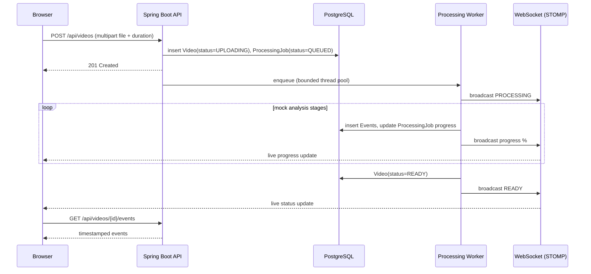
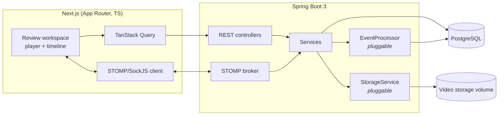

# Frame

A video analysis and review workspace: upload a video, watch it move through an async processing
pipeline in real time, then explore the result on a synchronized, multi-track interactive
timeline — scene changes, chapters, OCR text, audio events, speaker changes, and your own manual
markers, all clickable and filterable.


## Quickstart

```bash
docker compose up --build
```

- Frontend: http://localhost:3000
- Backend API + Swagger UI: http://localhost:8080/swagger-ui.html
- A demo login is seeded automatically on first startup: **demo@frame.dev / password**

There's no pre-loaded sample video (see [docs/PROGRESS.md](docs/PROGRESS.md) for why) — log in,
upload any short clip, and watch it go `UPLOADING → QUEUED → PROCESSING → READY` in real time over
a WebSocket, typically in under 10 seconds.

## Core workflow



## Architecture



## Features

- **Upload → async pipeline**: multipart upload, backed by a bounded thread pool (not
  fire-and-forget unbounded async), with every stage visible in real time.
- **Multi-track timeline**: scenes, chapters, OCR text, audio events, and speaker changes each get
  their own track; click any event to jump the player to that exact timestamp; toggle tracks on/off
  instantly (client-side filtering, no round trip per toggle).
- **Event inspector**: click an event to see its full detail — description, confidence score, and
  type-specific metadata.
- **Manual markers**: drop a labeled, colored marker at the current playhead position for your own
  notes; separate from the auto-generated events, with its own ownership/CRUD.
- **Live processing progress**: STOMP-over-SockJS WebSocket, not polling, drives both the
  dashboard's video list and the review page's progress bar.

## Tech stack

| Layer | Choice |
|---|---|
| Frontend | Next.js 16 (App Router), TypeScript, Tailwind CSS, Radix UI primitives, TanStack Query, Zustand, STOMP.js |
| Backend | Java 17, Spring Boot 3.3, Spring Data JPA, Spring Security (JWT), Spring WebSocket (STOMP) |
| Database | PostgreSQL 16, Flyway migrations, `jsonb` for per-event-type metadata |
| Storage | Local filesystem (Docker volume), behind a `StorageService` interface |
| Processing | Fully simulated event generation behind a pluggable `EventProcessor` interface |
| Ops | Docker Compose (postgres + backend + frontend), each with its own Dockerfile |

## Key design decisions

These are expanded with full trade-off reasoning in [docs/ARCHITECTURE.md](docs/ARCHITECTURE.md);
short version:

- **Processing is simulated, not real ffmpeg/AI** — deliberately, to ship the whole pipeline
  (state machine, async execution, WebSocket progress, timeline UI) quickly. It sits behind an
  `EventProcessor` interface specifically so a real analyzer is a drop-in `@Bean` + config flag
  later, not a rewrite.
- **Bounded processing thread pool**, not Spring's default unbounded async executor — bounded
  latency and resource usage under concurrent uploads, at the cost of queuing under heavy burst
  load.
- **Video duration comes from the browser**, not server-side parsing — the client reads it via a
  throwaway `<video>` element before upload, so the mock processor can scale event timestamps to
  something real without needing ffprobe on the server.
- **Hybrid canvas + DOM timeline** — canvas for the ruler/playhead (redrawn every animation frame,
  cheap), individual event markers as real DOM elements (so click/hover/tooltip/a11y are ordinary
  React, not hand-rolled canvas hit-testing).
- **A `requestAnimationFrame` loop, not `timeupdate`, drives the playhead** — `timeupdate` fires at
  an inconsistent, coarse rate across browsers; a ref updated every frame (not React state) feeds
  the canvas draw loop directly, with a separate, throttled state value for the on-screen time
  readout only.
- **JWT in `localStorage`, not an httpOnly cookie** — simpler to build (no CSRF handling, no
  server-side session), with the XSS trade-off explicitly accepted for a portfolio demo and called
  out as a real gap for a production deployment.

## Project structure

```
Frame/
  backend/     Spring Boot API (Controller → Service → Repository, DTOs at the boundary)
  frontend/    Next.js App Router client
  docker-compose.yml
  docs/
    PROGRESS.md      build log — what shipped, what was deliberately descoped, and why
    ARCHITECTURE.md  Phase 2: deep-dive + interview trade-off cheat sheet
```

See [docs/PROGRESS.md](docs/PROGRESS.md) for the full build log, including what got verified and
what didn't (the backend couldn't be compiled in the environment it was written in — no
Java/Maven/Docker available — while the frontend was fully typechecked, linted, built, and
smoke-tested in a browser).
